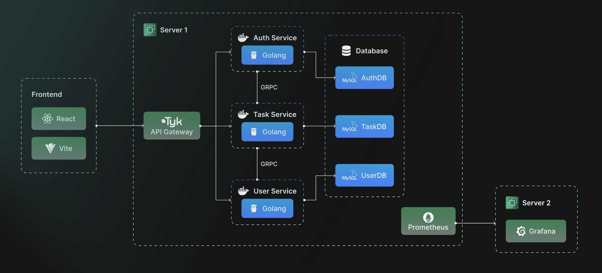
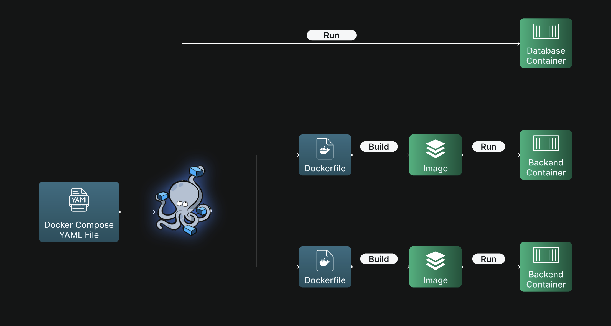

# Simple microservices with TODO application

## Architecture



## Build Flow



## How to setup local development

1. Install `docker` and `docker-compose`
2. Run docker-compose build command:

    ```bash
    docker-compose up --build -d
    ```

3. Access `http://localhost` for user interface
4. Register an account and enjoy exploring
